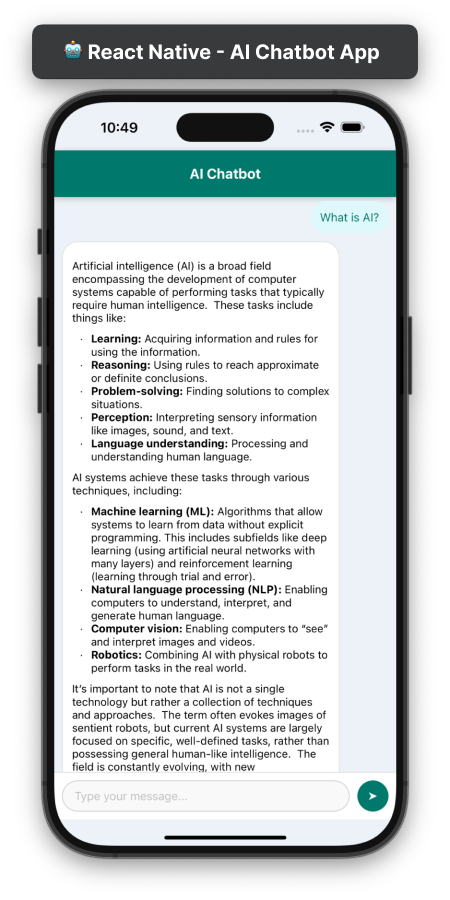

# 🤖 AI Chatbot App

A simple React Native chatbot powered by Google's Generative AI (Gemini 1.5 Flash) API. This app allows users to chat with an AI assistant in real-time with a clean and responsive UI.

## ✨ Features

-   💬 Real-time AI chat powered by Google's Generative AI.
-   📄 Markdown support in AI responses.
-   ⏳ Loading indicator during AI processing.
-   🎨 User-friendly UI with clear message distinction.

## 📱 Preview



## 🛠️ Tech Stack

-   **React Native**
-    **Google Generative AI API**
-    **react-native-markdown-display**
-    **TypeScript**

## 🚀 Installation

1.  **Clone the repository:**
    
    ```bash
    git clone https://github.com/your-username/ai-chatbot-app.git
    cd ai-chatbot-app
    ```
    
2.  **Install dependencies:**
    
    ```bash
    npm install
    # or
    yarn install
    ```
    
3.  **Set up environment variables:** Create a `.env` file in the project root and add your Google API key:
    
    ```env
    API_KEY=your_google_api_key_here
    ```
    
4.  **Run the app:**
    
    ```bash
    npx react-native run-android  # For Android 🤖
    npx react-native run-ios      # For iOS 🍎
    ```
    

## 📝 Usage

-  Type a message in the input field.
-   Press the send button or hit enter.
-   The AI will respond in real-time.

## 📂 Project Structure

```
├── App.tsx            # 🚀 Main application logic
├── package.json       # 📦 Project dependencies
├── .env               # 🔐 Environment variables
└── assets/            # 🖼️ App assets (images, icons)
```

## 📦 Dependencies

-   `react-native`
-   `react-native-markdown-display`
-   `@google/generative-ai`
-   `@env`


## 📬 Contact

For questions or feedback, feel free to reach out:

-   **GitHub:** [sai-zack-dev](https://github.com/sai-zack-dev)
-   **Email:** [saizlinh@gmail.com](mailto:saizlinh@gmail.com)
